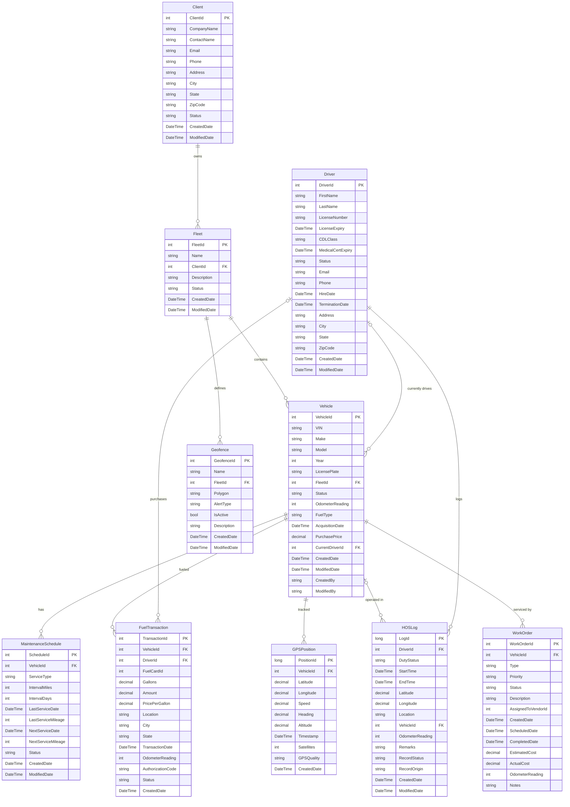

# TransFleet Data Model Specification

> Auto-generated from `TransFleet.Data` project analysis.

## Table of Contents

1. [Overview](#overview)
2. [Entity Types](#entity-types)
3. [Entity Relationships](#entity-relationships)
4. [EF6 Fluent API Configurations](#ef6-fluent-api-configurations)
5. [Repository & UnitOfWork Patterns](#repository--unitofwork-patterns)
6. [ER Diagram](#er-diagram)

---

## Overview

The data layer is implemented in **TransFleet.Data** using Entity Framework 6 with a Code-First approach on .NET Framework 4.7.2. The `TransFleetDbContext` manages 10 entity types across fleet management, driver compliance, fuel tracking, GPS telemetry, and maintenance domains.

| Aspect | Detail |
|---|---|
| ORM | Entity Framework 6 (Code-First) |
| Connection | Named `TransFleetConnection` |
| Lazy Loading | Enabled |
| Proxy Creation | Enabled |
| Mapping Style | Data Annotations + Fluent API |
| Data Access Pattern | Generic Repository + Unit of Work |

---

## Entity Types

### 1. Client

**Table:** `Clients` | **Key:** `ClientId` (int, identity)

| Property | CLR Type | Column Constraints | Notes |
|---|---|---|---|
| ClientId | `int` | PK, Identity | |
| CompanyName | `string` | Required, MaxLen 200 | |
| ContactName | `string` | MaxLen 100 | Nullable |
| Email | `string` | MaxLen 100 | Nullable |
| Phone | `string` | MaxLen 20 | Nullable |
| Address | `string` | MaxLen 200 | Nullable |
| City | `string` | MaxLen 100 | Nullable |
| State | `string` | MaxLen 50 | Nullable |
| ZipCode | `string` | MaxLen 20 | Nullable |
| Status | `string` | MaxLen 20 | Nullable |
| CreatedDate | `DateTime` | Not null | |
| ModifiedDate | `DateTime?` | Nullable | |

---

### 2. Fleet

**Table:** `Fleets` | **Key:** `FleetId` (int, identity)

| Property | CLR Type | Column Constraints | Notes |
|---|---|---|---|
| FleetId | `int` | PK, Identity | |
| Name | `string` | Required, MaxLen 100 | |
| ClientId | `int` | FK → Clients.ClientId | Not null |
| Description | `string` | MaxLen 500 | Nullable |
| Status | `string` | MaxLen 20 | Nullable |
| CreatedDate | `DateTime` | Not null | |
| ModifiedDate | `DateTime?` | Nullable | |

**Navigation:** `Client` (virtual, FK: `ClientId`)

---

### 3. Vehicle

**Table:** `Vehicles` | **Key:** `VehicleId` (int, identity)

| Property | CLR Type | Column Constraints | Notes |
|---|---|---|---|
| VehicleId | `int` | PK, Identity | |
| VIN | `string` | Required, MaxLen 17 | Vehicle Identification Number |
| Make | `string` | Required, MaxLen 50 | |
| Model | `string` | Required, MaxLen 50 | |
| Year | `int` | Not null | |
| LicensePlate | `string` | MaxLen 20 | Nullable |
| FleetId | `int` | FK → Fleets.FleetId | Not null |
| Status | `string` | MaxLen 20 | Active, Maintenance, Retired, Decommissioned |
| OdometerReading | `int` | Not null | |
| FuelType | `string` | MaxLen 20 | Diesel, Gasoline, Electric, Hybrid |
| AcquisitionDate | `DateTime?` | Nullable | |
| PurchasePrice | `decimal?` | Precision(18,2) | Fluent API configured |
| CurrentDriverId | `int?` | FK → Drivers.DriverId | Nullable |
| CreatedDate | `DateTime` | Not null | |
| ModifiedDate | `DateTime?` | Nullable | |
| CreatedBy | `string` | MaxLen 50 | Nullable |
| ModifiedBy | `string` | MaxLen 50 | Nullable |

**Navigation:** `Fleet` (virtual, FK: `FleetId`), `CurrentDriver` (virtual, FK: `CurrentDriverId`)

---

### 4. Driver

**Table:** `Drivers` | **Key:** `DriverId` (int, identity)

| Property | CLR Type | Column Constraints | Notes |
|---|---|---|---|
| DriverId | `int` | PK, Identity | |
| FirstName | `string` | Required, MaxLen 100 | |
| LastName | `string` | Required, MaxLen 100 | |
| LicenseNumber | `string` | Required, MaxLen 50 | |
| LicenseExpiry | `DateTime` | Not null | |
| CDLClass | `string` | MaxLen 10 | A, B, C |
| MedicalCertExpiry | `DateTime?` | Nullable | |
| Status | `string` | MaxLen 20 | Active, OnLeave, Terminated, Suspended |
| Email | `string` | MaxLen 100 | Nullable |
| Phone | `string` | MaxLen 20 | Nullable |
| HireDate | `DateTime` | Not null | |
| TerminationDate | `DateTime?` | Nullable | |
| Address | `string` | MaxLen 200 | Nullable |
| City | `string` | MaxLen 100 | Nullable |
| State | `string` | MaxLen 50 | Nullable |
| ZipCode | `string` | MaxLen 20 | Nullable |
| CreatedDate | `DateTime` | Not null | |
| ModifiedDate | `DateTime?` | Nullable | |

**Navigation:** None (referenced by Vehicle, FuelTransaction, HOSLog)

---

### 5. MaintenanceSchedule

**Table:** `MaintenanceSchedules` | **Key:** `ScheduleId` (int, identity)

| Property | CLR Type | Column Constraints | Notes |
|---|---|---|---|
| ScheduleId | `int` | PK, Identity | |
| VehicleId | `int` | FK → Vehicles.VehicleId | Not null |
| ServiceType | `string` | Required, MaxLen 100 | OilChange, TireRotation, BrakeInspection, etc. |
| IntervalMiles | `int?` | Nullable | |
| IntervalDays | `int?` | Nullable | |
| LastServiceDate | `DateTime?` | Nullable | |
| LastServiceMileage | `int?` | Nullable | |
| NextServiceDate | `DateTime?` | Nullable | |
| NextServiceMileage | `int?` | Nullable | |
| Status | `string` | MaxLen 20 | Active, Completed, Overdue, Cancelled |
| CreatedDate | `DateTime` | Not null | |
| ModifiedDate | `DateTime?` | Nullable | |

**Navigation:** `Vehicle` (virtual, FK: `VehicleId`)

---

### 6. FuelTransaction

**Table:** `FuelTransactions` | **Key:** `TransactionId` (int, identity)

| Property | CLR Type | Column Constraints | Notes |
|---|---|---|---|
| TransactionId | `int` | PK, Identity | |
| VehicleId | `int` | FK → Vehicles.VehicleId | Not null |
| DriverId | `int?` | FK → Drivers.DriverId | Nullable |
| FuelCardId | `int` | Not null | No FK navigation defined |
| Gallons | `decimal` | Precision(18,3) | Fluent API configured |
| Amount | `decimal` | Precision(18,2) | Fluent API configured |
| PricePerGallon | `decimal` | Precision(18,3) | Fluent API configured |
| Location | `string` | MaxLen 200 | Nullable |
| City | `string` | MaxLen 100 | Nullable |
| State | `string` | MaxLen 50 | Nullable |
| TransactionDate | `DateTime` | Not null | |
| OdometerReading | `int?` | Nullable | |
| AuthorizationCode | `string` | MaxLen 50 | Nullable |
| Status | `string` | MaxLen 20 | Approved, Pending, Declined, Flagged |
| CreatedDate | `DateTime` | Not null | |

**Navigation:** `Vehicle` (virtual, FK: `VehicleId`), `Driver` (virtual, FK: `DriverId`)

---

### 7. GPSPosition

**Table:** `GPSPositions` | **Key:** `PositionId` (long, identity)

| Property | CLR Type | Column Constraints | Notes |
|---|---|---|---|
| PositionId | `long` | PK, Identity | High-volume telemetry table |
| VehicleId | `int` | FK → Vehicles.VehicleId | Not null |
| Latitude | `decimal` | Precision(18,8) | Fluent API configured |
| Longitude | `decimal` | Precision(18,8) | Fluent API configured |
| Speed | `decimal?` | Precision(18,2) | Fluent API configured |
| Heading | `decimal?` | Precision(18,2) | Fluent API configured |
| Altitude | `decimal?` | Nullable | No custom precision |
| Timestamp | `DateTime` | Not null | |
| Satellites | `int?` | Nullable | |
| GPSQuality | `string` | MaxLen 20 | Nullable |
| CreatedDate | `DateTime` | Not null | |

**Navigation:** `Vehicle` (virtual, FK: `VehicleId`)

---

### 8. HOSLog

**Table:** `HOSLogs` | **Key:** `LogId` (long, identity)

| Property | CLR Type | Column Constraints | Notes |
|---|---|---|---|
| LogId | `long` | PK, Identity | High-volume compliance table |
| DriverId | `int` | FK → Drivers.DriverId | Not null |
| DutyStatus | `string` | Required, MaxLen 20 | OffDuty, SleeperBerth, Driving, OnDuty |
| StartTime | `DateTime` | Not null | |
| EndTime | `DateTime?` | Nullable | |
| Latitude | `decimal?` | Precision(18,8) | Fluent API configured |
| Longitude | `decimal?` | Precision(18,8) | Fluent API configured |
| Location | `string` | MaxLen 200 | Nullable |
| VehicleId | `int?` | FK → Vehicles.VehicleId | Nullable |
| OdometerReading | `int?` | Nullable | |
| Remarks | `string` | MaxLen 500 | Nullable |
| RecordStatus | `string` | MaxLen 20 | Active, Changed, Inactive |
| RecordOrigin | `string` | MaxLen 50 | Auto, Manual, Edited |
| CreatedDate | `DateTime` | Not null | |
| ModifiedDate | `DateTime?` | Nullable | |

**Navigation:** `Driver` (virtual, FK: `DriverId`), `Vehicle` (virtual, FK: `VehicleId`)

---

### 9. Geofence

**Table:** `Geofences` | **Key:** `GeofenceId` (int, identity)

| Property | CLR Type | Column Constraints | Notes |
|---|---|---|---|
| GeofenceId | `int` | PK, Identity | |
| Name | `string` | Required, MaxLen 100 | |
| FleetId | `int` | FK → Fleets.FleetId | Not null |
| Polygon | `string` | Required, MaxLen 4000 | GeoJSON polygon |
| AlertType | `string` | MaxLen 50 | Entry, Exit, Both |
| IsActive | `bool` | Not null | |
| Description | `string` | MaxLen 500 | Nullable |
| CreatedDate | `DateTime` | Not null | |
| ModifiedDate | `DateTime?` | Nullable | |

**Navigation:** `Fleet` (virtual, FK: `FleetId`)

---

### 10. WorkOrder

**Table:** `WorkOrders` | **Key:** `WorkOrderId` (int, identity)

| Property | CLR Type | Column Constraints | Notes |
|---|---|---|---|
| WorkOrderId | `int` | PK, Identity | |
| VehicleId | `int` | FK → Vehicles.VehicleId | Not null |
| Type | `string` | Required, MaxLen 100 | Repair, Inspection, Recall, Modification |
| Priority | `string` | MaxLen 20 | Low, Medium, High, Critical |
| Status | `string` | MaxLen 20 | Open, InProgress, Completed, Cancelled |
| Description | `string` | MaxLen 1000 | Nullable |
| AssignedToVendorId | `int?` | Nullable | No FK navigation defined |
| CreatedDate | `DateTime` | Not null | |
| ScheduledDate | `DateTime?` | Nullable | |
| CompletedDate | `DateTime?` | Nullable | |
| EstimatedCost | `decimal?` | Precision(18,2) | Fluent API configured |
| ActualCost | `decimal?` | Precision(18,2) | Fluent API configured |
| OdometerReading | `int?` | Nullable | |
| Notes | `string` | MaxLen 2000 | Nullable |

**Navigation:** `Vehicle` (virtual, FK: `VehicleId`)

---

## Entity Relationships

### One-to-Many Relationships

| Parent Entity | Child Entity | FK Property | FK Column | Nullable | Cascade |
|---|---|---|---|---|---|
| **Client** → Fleet | Fleet | `ClientId` | `ClientId` | No | EF default |
| **Fleet** → Vehicle | Vehicle | `FleetId` | `FleetId` | No | EF default |
| **Fleet** → Geofence | Geofence | `FleetId` | `FleetId` | No | EF default |
| **Driver** → Vehicle | Vehicle | `CurrentDriverId` | `CurrentDriverId` | Yes | No cascade |
| **Driver** → FuelTransaction | FuelTransaction | `DriverId` | `DriverId` | Yes | No cascade |
| **Driver** → HOSLog | HOSLog | `DriverId` | `DriverId` | No | EF default |
| **Vehicle** → MaintenanceSchedule | MaintenanceSchedule | `VehicleId` | `VehicleId` | No | EF default |
| **Vehicle** → FuelTransaction | FuelTransaction | `VehicleId` | `VehicleId` | No | EF default |
| **Vehicle** → GPSPosition | GPSPosition | `VehicleId` | `VehicleId` | No | EF default |
| **Vehicle** → HOSLog | HOSLog | `VehicleId` | `VehicleId` | Yes | No cascade |
| **Vehicle** → WorkOrder | WorkOrder | `VehicleId` | `VehicleId` | No | EF default |

### Orphaned Foreign Keys (no navigation property defined)

| Entity | FK Property | Notes |
|---|---|---|
| FuelTransaction | `FuelCardId` | References an external fuel card system; no entity mapping |
| WorkOrder | `AssignedToVendorId` | References an external vendor system; no entity mapping |

### Many-to-Many Relationships

No many-to-many relationships are defined in the current model.

---

## EF6 Fluent API Configurations

All Fluent API configurations are defined in `TransFleetDbContext.OnModelCreating()`. The model uses a hybrid mapping approach: structural mappings (table names, keys, required fields, string lengths) via **Data Annotations**, and precision configurations via **Fluent API**.

### Decimal Precision Configurations

| Entity | Property | Precision | Scale | Purpose |
|---|---|---|---|---|
| FuelTransaction | `Amount` | 18 | 2 | Currency |
| FuelTransaction | `Gallons` | 18 | 3 | Volume measurement |
| FuelTransaction | `PricePerGallon` | 18 | 3 | Unit price |
| Vehicle | `PurchasePrice` | 18 | 2 | Currency |
| WorkOrder | `EstimatedCost` | 18 | 2 | Currency |
| WorkOrder | `ActualCost` | 18 | 2 | Currency |
| GPSPosition | `Latitude` | 18 | 8 | GPS coordinate |
| GPSPosition | `Longitude` | 18 | 8 | GPS coordinate |
| GPSPosition | `Speed` | 18 | 2 | Velocity |
| GPSPosition | `Heading` | 18 | 2 | Compass bearing |
| HOSLog | `Latitude` | 18 | 8 | GPS coordinate |
| HOSLog | `Longitude` | 18 | 8 | GPS coordinate |

### Data Annotation Summary

| Annotation | Usage |
|---|---|
| `[Table("...")]` | Explicit table naming on all 10 entities |
| `[Key]` | Primary key on all entities |
| `[Required]` | Non-nullable business fields (names, VIN, types, etc.) |
| `[StringLength(n)]` | Max length on all string properties |
| `[ForeignKey("...")]` | FK mapping on navigation properties |

### Notable Absent Configurations

- No explicit **index** definitions (no `[Index]` attributes or Fluent API `.HasIndex()`)
- No **unique constraints** (e.g., VIN uniqueness is not enforced at the DB level)
- No **delete behavior** overrides (all use EF6 cascade defaults)
- No **seed data** in the context
- No **computed columns** or **database-generated** attributes beyond identity PKs

---

## Repository & UnitOfWork Patterns

### IRepository\<T\> Interface

Defined in `TransFleet.Data.Repositories.Repository.cs`:

```csharp
public interface IRepository<T> where T : class
{
    T GetById(object id);
    IEnumerable<T> GetAll();
    IEnumerable<T> Find(Expression<Func<T, bool>> predicate);
    void Add(T entity);
    void AddRange(IEnumerable<T> entities);
    void Remove(T entity);
    void RemoveRange(IEnumerable<T> entities);
    void Update(T entity);
}
```

| Method | Behavior |
|---|---|
| `GetById(object id)` | Delegates to `DbSet.Find(id)` — uses PK lookup with EF cache |
| `GetAll()` | Returns `DbSet.ToList()` — materializes entire table into memory |
| `Find(predicate)` | Applies `Where(predicate).ToList()` — server-side filtering |
| `Add(entity)` | Delegates to `DbSet.Add()` — marks as Added |
| `AddRange(entities)` | Delegates to `DbSet.AddRange()` — batch insert |
| `Remove(entity)` | Delegates to `DbSet.Remove()` — marks as Deleted |
| `RemoveRange(entities)` | Delegates to `DbSet.RemoveRange()` — batch delete |
| `Update(entity)` | Sets `Entry(entity).State = EntityState.Modified` — marks entire entity dirty |

### Repository\<T\> Implementation Details

- Generic constraint: `where T : class`
- Accepts `DbContext` (not `TransFleetDbContext`) — loosely coupled to context type
- Stores `DbContext` as `protected readonly Context`
- Stores `DbSet<T>` as `protected readonly DbSet`
- No async methods — all operations are synchronous
- No `IQueryable<T>` exposure — queries always materialize via `.ToList()`

### IUnitOfWork Interface

Defined in `TransFleet.Data.UnitOfWork.cs`:

```csharp
public interface IUnitOfWork : IDisposable
{
    IRepository<T> Repository<T>() where T : class;
    int SaveChanges();
}
```

### UnitOfWork Implementation Details

- Takes `TransFleetDbContext` via constructor injection
- Creates a **new `Repository<T>`** on every `Repository<T>()` call (no caching/dictionary)
- `SaveChanges()` delegates to `_context.SaveChanges()`
- Implements `IDisposable` — disposes the underlying context
- No transaction management (`BeginTransaction`/`Commit`/`Rollback`)
- No async `SaveChangesAsync()` support

### Design Observations

| Concern | Current State | Impact |
|---|---|---|
| Repository caching | New instance per call | Minor overhead; no shared tracking issues |
| Async support | Not implemented | All DB calls block the calling thread |
| IQueryable exposure | Not exposed | Prevents composable LINQ; all results fully materialized |
| Transaction scope | Not managed | Multi-entity saves rely on single `SaveChanges()` atomicity |
| Specification pattern | Not implemented | Complex queries must use `Find()` predicate |

---

## ER Diagram



---

## Source Files Reference

| File | Purpose |
|---|---|
| `TransFleet.Data\TransFleetDbContext.cs` | EF6 DbContext with DbSets and Fluent API |
| `TransFleet.Data\UnitOfWork.cs` | IUnitOfWork interface and implementation |
| `TransFleet.Data\Repositories\Repository.cs` | Generic IRepository\<T\> and implementation |
| `TransFleet.Data\Entities\Client.cs` | Client entity |
| `TransFleet.Data\Entities\Fleet.cs` | Fleet entity |
| `TransFleet.Data\Entities\Vehicle.cs` | Vehicle entity |
| `TransFleet.Data\Entities\Driver.cs` | Driver entity |
| `TransFleet.Data\Entities\MaintenanceSchedule.cs` | Maintenance schedule entity |
| `TransFleet.Data\Entities\FuelTransaction.cs` | Fuel transaction entity |
| `TransFleet.Data\Entities\GPSPosition.cs` | GPS telemetry entity |
| `TransFleet.Data\Entities\HOSLog.cs` | Hours of Service log entity |
| `TransFleet.Data\Entities\Geofence.cs` | Geofence entity |
| `TransFleet.Data\Entities\WorkOrder.cs` | Work order entity |
